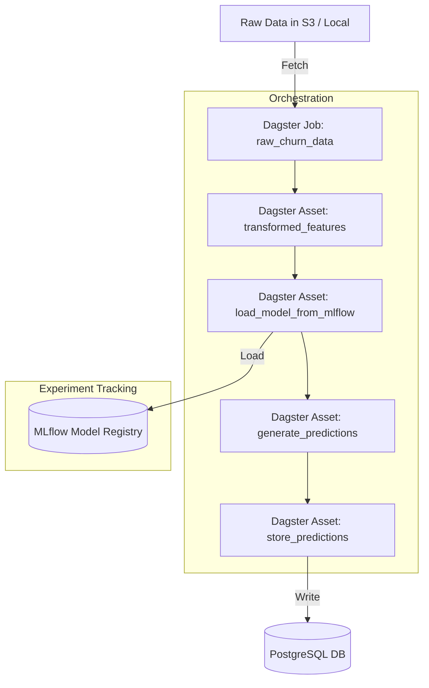

# BetterCollective MLOps Tech Assignment

Solution proposed by [Jonathan Deiloff](https://github.com/jdeiloff).

## Architecture Diagram

Below is a high-level architecture diagram of the MLOps pipeline implemented in this repository:



## Repository Structure (Current State)

```
README.md
orchestration/
    README.md
    job.py
    requirements.txt
    config/
        dagster.yaml
    db/
        init.sql
experiment_tracking/
    setup.py
    log_model.py
    db/
        init.sql
    requirements.txt
    pyproject.toml
data/
    churn/
        feature_names_3.json
        X_test_sample_2.json
docs/
    Senior_MLOps_Engineer_Take-Home_2.pdf
models/
    churn/
        xgb_churn_model_2.bin
        xgb_churn_model_2.json
notebooks/
tests/
```

## Assessment Sections

### Section 1: MLFlow & Experiment Tracking

This section covers the setup of the MLflow tracking environment and the process of logging and registering the churn model.

#### 1. Setting up the Tracking Environment

The `experiment_tracking/setup.py` script is used to configure the MLflow tracking server.

**Prerequisites:**

*   A running deployed PostgreSQL server.
*   An AWS S3 bucket.
*   An AWS Secrets Manager secret containing the PostgreSQL credentials in the format `{'username': 'user', 'password': 'pass'}`.
*   Permissions and credentials to access the S3 bucket, PostgreSQL instance (RDS or deployed VM, etc), and the AWS Secrets Manager secrets.

**Usage:**

1.  Install the required Python packages using `uv` (recommended):
    ```bash
    # Install uv if you don't have it already
    pip install uv
    
    # Install dependencies using pyproject.toml
    uv pip install -e experiment_tracking
    ```
   
   Alternatively, you can use pip:
   ```bash
   pip install -r experiment_tracking/requirements.txt
   ```
2.  Set the following environment variables:
    ```bash
    export MLFLOW_SECRET_NAME="your_secret_name"
    export MLFLOW_S3_BUCKET="your_s3_bucket_name"
    # Optional variables
    export MLFLOW_DB_NAME="mlflow_db"
    export MLFLOW_DB_HOST="localhost"
    export MLFLOW_DB_PORT="5432"
    export MLFLOW_SECRET_REGION="us-east-1"
    ```
3.  Run the script:
    ```bash
    python experiment_tracking/setup.py
    ```

This will create the specified database if it doesn't exist and set up the necessary tables. To create experiments for different model variants, you can use the optional `--geography` and `--company` flags:

```bash
# Create an experiment for a specific geography
python experiment_tracking/setup.py --geography US

# Create an experiment for a specific company
python experiment_tracking/setup.py --company ClientA
```

This will create experiments with names like `churn_prediction-geography-us` and `churn_prediction-company-clienta`.

#### 2. Logging and Registering the Model

The `experiment_tracking/log_model.py` script handles the logging of the model, its metadata, and registration in the MLflow Model Registry. It sources the model artifacts directly from an S3 bucket and supports logging different model variants.

**Usage:**

1.  Ensure the tracking environment and the desired experiment are set up as described above.
2.  Make sure the model artifacts for the variant you want to log are present in the corresponding S3 path. For example, for the `US` geography, the artifacts should be in `s3://<your-bucket>/geography-us/`.
3.  Set the required environment variables:
    ```bash
    export MLFLOW_TRACKING_URI="postgresql://<user>:<password>@<host>:<port>/<db_name>"
    export MLFLOW_S3_BUCKET="your_s3_bucket_name"
    ```
    Replace the placeholders with your actual database credentials and connection info.
4.  Run the script from the `experiment_tracking` directory, specifying the model variant if needed:
    ```bash
    # Log the base model
    python log_model.py

    # Log a model for a specific geography
    python log_model.py --geography US

    # Log a model for a specific company and geography
    python log_model.py --geography EU --company ClientB
    ```

This script will:
*   Start a new MLflow run in the appropriate experiment based on the arguments.
*   Load the XGBoost model and its data from the corresponding S3 path.
*   Apply tags to the run (e.g., `geography: US`).
*   Infer a model signature for schema validation.
*   Log dummy parameters and metrics.
*   Register the model with a variant-specific name (e.g., `churn-prediction-model-us`).

### Bonus Section: Supporting Multiple Model Variants

To adapt this project for multiple model variants (e.g., for different geographies or companies), the scripts have been parameterized to support a scalable and organized workflow.

#### 1. Dynamic Experiment and Model Naming

The `setup.py` and `log_model.py` scripts use optional `--geography` and `--company` arguments to dynamically construct experiment names and registered model names. This ensures that each variant is tracked and registered separately.

*   **Experiment Name Example:** `churn_prediction-geography-us`
*   **Registered Model Name Example:** `churn-prediction-model-us`

#### 2. S3 Artifact Paths

The `log_model.py` script loads artifacts from S3 paths that are also constructed based on the provided arguments. This keeps the artifacts for different model variants organized in the S3 bucket.

*   **S3 Path Example:** For a model with `--geography US`, the script will look for artifacts in `s3://<your-bucket>/geography-us/`.

#### 3. Leveraging MLflow Tags

Tags are automatically applied to each run to capture the variant information. This allows for easy filtering and comparison of runs in the MLflow UI.

*   **Example Tags:**
    *   `geography`: `US`
    *   `company_id`: `ClientB`
    *   `training_date`: `2024-07-07`

#### 4. Parameterized Scripts Implementation

The scripts use Python's `argparse` library to handle the optional command-line arguments. If no arguments are provided, the scripts will default to logging the base `churn_prediction` model.

This allows you to trigger logging for different variants with a single, reusable script:

```bash
# Log a model for US geography
python log_model.py --geography US

# Log a model for a specific EU company
python log_model.py --geography EU --company ClientA
```

By combining these strategies, the project provides a well-organized and scalable MLOps workflow that effectively manages numerous model variants without having to overengineer the organization of the projects or creating more layers of folders and directories.

### Section 2: Orchestration with Dagster

This section details the orchestration of the machine learning pipeline using Dagster. The primary goal is to automate the process of generating predictions from the trained churn model and storing them for downstream use.

#### 1. Dagster Job for Prediction

A Dagster job, defined in `orchestration/job.py`, has been created to orchestrate the following steps:

1.  **Fetch Raw Input Data**: The pipeline starts by fetching the raw input data required for predictions. Currently, it reads from the sample data located in the `data/churn` directory.
2.  **Apply Feature Transformations**: A placeholder asset is included for any necessary feature transformations. This allows for future extension without altering the core pipeline structure.
3.  **Load Trained Model from MLflow**: The job loads the latest production-ready model from the MLflow Model Registry. The MLflow tracking server URI and model details are configured via the `orchestration/config/dagster.yaml` file.
4.  **Generate Predictions**: Using the loaded model, the pipeline generates churn predictions for the input data.
5.  **Store Predictions**: The generated predictions, along with metadata like the model version, are stored in a PostgreSQL database. The database connection details are securely fetched from AWS Secrets Manager.

#### 2. Scheduling and Robustness

To ensure the pipeline is both reliable and runs consistently, the following features have been implemented:

*   **Weekly Schedule**: The prediction job is scheduled to run automatically every Monday at midnight UTC. This is defined in `orchestration/job.py` using Dagster's scheduling capabilities.
*   **New Data Detection**: The `raw_churn_data` asset includes a placeholder where logic can be added to detect and process only new, unseen data. This is crucial for running the pipeline efficiently in a production environment.
*   **Retry Logic**: Critical steps, such as storing predictions in the database, are equipped with a retry policy. If a transient error occurs, Dagster will automatically retry the step, increasing the pipeline's resilience.

For more detailed information about the Dagster implementation, please refer to the `orchestration/README.md` file.

#### 3. S3 Fallback for Data Ingestion

The pipeline is designed to fetch the raw churn data and feature names from an S3 artifact store (using the `MLFLOW_S3_BUCKET` environment variable). If S3 is unavailable or the fetch fails, it automatically falls back to loading the files from the local `data/churn` directory. This ensures robust and flexible data ingestion for both cloud and local development environments.


### Section 3: Questions

They are answered in the file [section_3_answers.md](docs/section_3_answers.md).

### Recommendations and suggestions if having more time:

If I would have more time, I would like to implement the data drift and model performance degradation metrics and alerts Dagster assets, maybe introducing a Feature Store to get static data using the exact same logic for training, batch prediction and it can also provide value as the features can be attached or linked to a specific point in time, reproducing stationality and preventing data leakage. This Feature Store would replace the raw churn data ingestion. I would also add the deployment of A/B Testing for models, with a simple switch to promote the best model to production to do fast iterations in the model performance testing.
I would also store the feature importances for each prediction, to enable model explainability to understand why a prediction was made like that.

